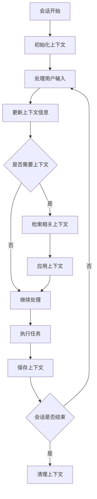

# 上下文管理决策

## 核心概念

上下文管理是 Nanobot 系统维护会话连贯性的关键机制。通过管理和利用会话历史、用户信息和任务状态，确保系统能够理解用户的意图并提供一致的服务。

## 管理流程

## 管理策略

### 1. 上下文类型
- **会话上下文**：当前会话的所有交互历史
- **用户上下文**：用户的基本信息和偏好设置
- **任务上下文**：当前正在执行的任务状态和结果
- **系统上下文**：系统状态和可用资源信息

### 2. 上下文存储
- **内存存储**：短期会话上下文存储在内存中
- **持久化存储**：用户上下文和长期任务信息存储在数据库中
- **上下文压缩**：对大量历史信息进行压缩处理

### 3. 上下文检索
- **关键词检索**：通过关键词匹配检索相关上下文
- **语义检索**：基于语义相似性检索相关上下文
- **时间检索**：按时间顺序检索历史上下文

## 示例场景

### 场景 1：会话上下文管理
**用户交互**：
1. 用户："我想学习 Python"
2. 系统："好的，我会帮助您学习 Python。您想从哪里开始？"
3. 用户："基础语法"

**上下文管理**：
- 存储第一次交互的意图（学习 Python）
- 检索会话上下文，理解用户想要学习 Python 的基础语法
- 提供针对性的学习资源

### 场景 2：任务上下文管理
**任务描述**：开发一个数据分析脚本
**上下文管理**：
- 存储任务的当前状态（已完成数据读取，正在进行数据清洗）
- 记录已处理的数据集和清洗规则
- 当任务暂停后恢复时，能够从断点继续执行

## 最佳实践

1. **上下文边界**：明确上下文的范围和生命周期，避免过度收集信息
2. **隐私保护**：对敏感信息进行加密和匿名化处理
3. **上下文更新**：及时更新上下文信息，确保数据一致性
4. **上下文清理**：会话结束后清理临时上下文，释放资源
5. **容错处理**：处理上下文丢失或损坏的情况，提供恢复机制
