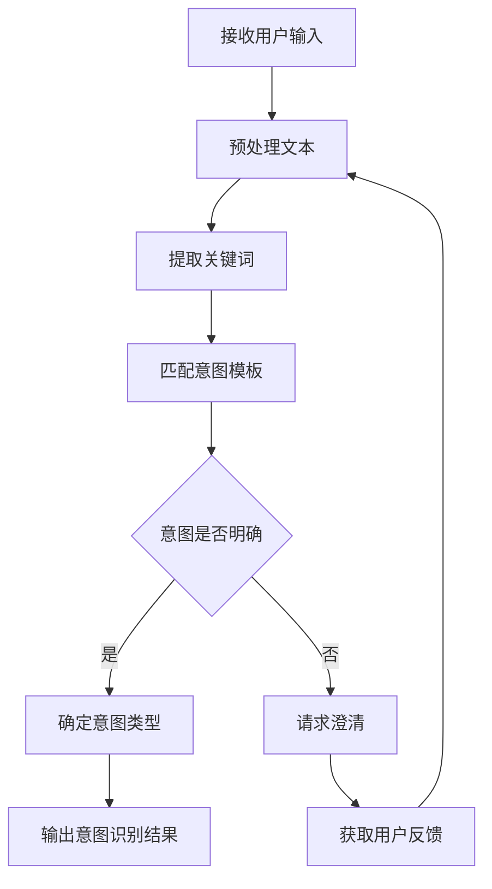

# 意图识别规则和流程

## 核心定义

意图识别是 Nanobot 系统理解用户需求的关键环节。通过分析用户输入的文本、上下文信息和历史记录，准确判断用户的真实意图，为后续的任务分配和技能选择提供基础。

## 识别流程

## 识别规则

### 1. 关键词匹配法
- 核心关键词：直接匹配预设的意图关键词
- 同义词扩展：考虑语义相似的词汇
- 否定词处理：识别否定表达，调整意图判断

### 2. 上下文分析
- 会话历史：分析用户之前的输入
- 任务状态：考虑当前正在执行的任务
- 时间信息：识别时间相关的意图

### 3. 模式匹配
- 常见句式：识别固定的提问或指令模式
- 参数提取：从输入中提取关键参数
- 意图分类：根据预定义的意图类别进行分类

## 示例场景

### 场景 1：代码问题咨询
**用户输入**："如何在 Python 中读取 CSV 文件？"
**识别过程**：
- 关键词：Python, 读取, CSV 文件
- 意图模板：技术问题咨询
- 意图类型：代码实现指导
- 输出：`{'intent': 'code_guidance', 'parameters': {'language': 'Python', 'operation': 'read', 'file_type': 'CSV'}}`

### 场景 2：任务请求
**用户输入**："帮我写一个爬虫脚本"
**识别过程**：
- 关键词：写, 爬虫, 脚本
- 意图模板：任务请求
- 意图类型：代码编写任务
- 输出：`{'intent': 'code_writing', 'parameters': {'task_type': 'crawler'}}`

## 最佳实践

1. **保持简洁性**：避免过度复杂的意图分类
2. **定期更新**：根据用户反馈持续优化意图模板
3. **容错处理**：对模糊输入提供明确的澄清引导
4. **语义理解**：结合自然语言处理提升识别准确率
5. **参数提取**：确保关键信息的准确识别和提取
