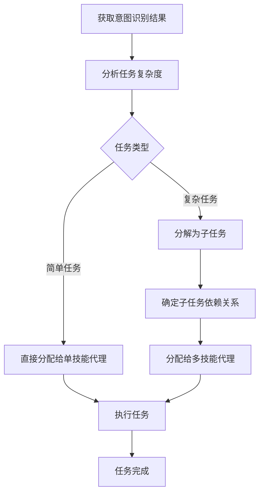

# 任务分配策略

## 核心原则

任务分配是 Nanobot 系统将识别到的用户意图转化为具体任务的关键环节。通过合理的分配策略，确保任务能够高效、准确地执行。

## 分配流程

## 分配策略

### 1. 基于复杂度的分配
- **简单任务**：直接分配给具备相关技能的单代理
- **中等任务**：分配给具备多种相关技能的代理
- **复杂任务**：分解为子任务，分配给多个专业代理协作完成

### 2. 基于技能匹配度的分配
- **精确匹配**：选择技能完全匹配的代理
- **近似匹配**：选择技能最相近的代理
- **综合评估**：考虑技能匹配度和经验值

### 3. 基于负载均衡的分配
- **代理可用性**：优先选择空闲的代理
- **任务优先级**：高优先级任务优先分配
- **资源利用**：合理分配资源，避免过度负载

## 示例场景

### 场景 1：简单代码修改任务
**任务描述**：修改 Python 脚本中的字符串处理逻辑
**分配策略**：
- 任务复杂度：简单
- 技能需求：Python 编程，字符串处理
- 分配结果：分配给具备 Python 编程技能的单代理

### 场景 2：复杂系统开发任务
**任务描述**：开发一个包含前端、后端和数据库的完整应用
**分配策略**：
- 任务复杂度：复杂
- 分解子任务：前端开发、后端开发、数据库设计
- 分配结果：
  - 前端开发：分配给具备 React 技能的代理
  - 后端开发：分配给具备 Django 技能的代理
  - 数据库设计：分配给具备 PostgreSQL 技能的代理

## 最佳实践

1. **任务分解原则**：遵循单一职责原则，每个子任务专注于一个功能
2. **依赖管理**：明确子任务之间的依赖关系，确保执行顺序
3. **代理选择**：综合考虑技能匹配度、经验和可用性
4. **动态调整**：根据任务执行情况，动态调整分配策略
5. **结果验证**：确保任务分配符合用户需求和系统目标
