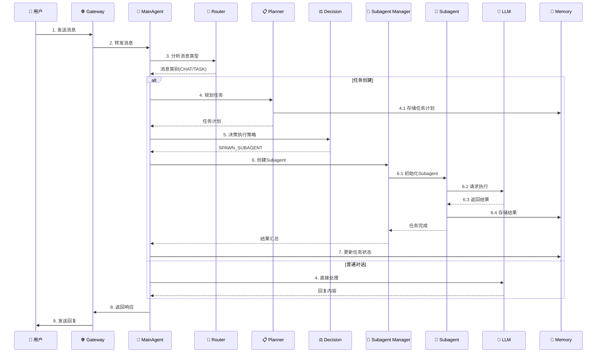
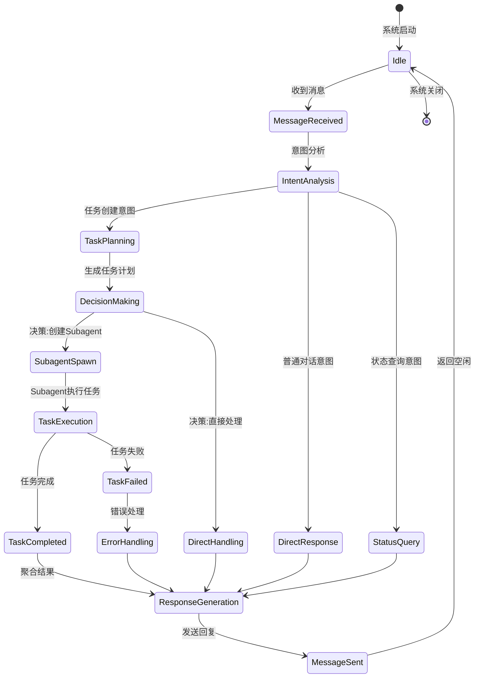

# MainAgent 组件

> MainAgent 是 Nanobot 系统的核心协调器，负责整个系统的任务调度、决策制定和资源管理。

---

## 1. 概述

### 1.1 职责

MainAgent 作为系统的中央控制器，承担以下核心职责：

- **消息处理**: 接收和解析用户消息
- **任务规划**: 分析任务复杂度，进行任务分解
- **决策制定**: 决定任务执行策略（直接处理/创建Subagent）
- **资源协调**: 管理 Subagent 池和任务队列
- **状态管理**: 维护系统状态和会话上下文
- **响应聚合**: 收集和整合执行结果

### 1.2 架构位置

```
┌─────────────────────────────────────────────────────────────┐
│                        MainAgent                            │
│  ┌─────────────────────────────────────────────────────┐  │
│  │                      Core Logic                      │  │
│  │  ┌──────────┐ ┌──────────┐ ┌──────────┐ ┌──────────┐  │  │
│  │  │ Message  │ │   Task   │ │ Decision│ │ Response│  │  │
│  │  │ Handler  │ │ Planner  │ │  Maker  │ │ Handler│  │  │
│  │  └──────────┘ └──────────┘ └──────────┘ └──────────┘  │  │
│  └─────────────────────────────────────────────────────┘  │
│  ┌─────────────────────────────────────────────────────┐  │
│  │                    Managers                          │  │
│  │  ┌──────────┐ ┌──────────┐ ┌──────────┐ ┌────────┐  │  │
│  │  │Subagent  │ │ Context  │ │  Memory  │ │ Workflow│ │  │
│  │  │ Manager  │ │ Manager  │ │  Manager │ │ Manager │ │  │
│  │  └──────────┘ └──────────┘ └──────────┘ └────────┘  │  │
│  └─────────────────────────────────────────────────────┘  │
└─────────────────────────────────────────────────────────────┘
```

---

## 2. 核心组件

### 2.1 Message Handler（消息处理器）

**职责**: 接收、解析和路由用户消息。

**工作流程**:
```python
async def handle_message(message: str, context: Context) -> Response:
    # 1. 消息解析和验证
    parsed_message = parse_message(message)
    
    # 2. 意图识别
    intent = await recognize_intent(parsed_message)
    
    # 3. 消息路由
    if intent.is_task_creation:
        return await handle_task_creation(parsed_message)
    elif intent.is_status_query:
        return await handle_status_query(parsed_message)
    else:
        return await handle_conversation(parsed_message)
```

**关键方法**:
- `parse_message()`: 解析原始消息
- `recognize_intent()`: 意图识别
- `route_message()`: 消息路由

### 2.2 Task Planner（任务规划器）

**职责**: 分析任务复杂度，进行任务分解和规划。

**工作流程**:
```python
async def plan_task(task_description: str) -> TaskPlan:
    # 1. 复杂度分析
    complexity = await analyze_complexity(task_description)
    
    # 2. 任务分解
    if complexity.is_high:
        subtasks = await decompose_task(task_description)
    else:
        subtasks = [SimpleTask(task_description)]
    
    # 3. 依赖分析
    dependencies = await analyze_dependencies(subtasks)
    
    # 4. 生成任务计划
    return TaskPlan(
        tasks=subtasks,
        dependencies=dependencies,
        estimated_duration=calculate_duration(subtasks)
    )
```

**关键方法**:
- `analyze_complexity()`: 任务复杂度分析
- `decompose_task()`: 任务分解
- `analyze_dependencies()`: 依赖分析

### 2.3 Decision Maker（决策器）

**职责**: 决定任务的执行策略。

**决策类型**:
```python
class ExecutionDecision(Enum):
    SPAWN_SUBAGENT = "spawn_subagent"      # 创建 Subagent 执行
    HANDLE_DIRECTLY = "handle_directly"    # MainAgent 直接处理
    REQUEST_INFO = "request_info"          # 请求更多信息
    DELEGATE = "delegate"                  # 委托给其他系统
```

**决策流程**:
```python
async def make_decision(task: Task, context: Context) -> ExecutionDecision:
    # 1. 分析任务特性
    characteristics = await analyze_task(task)
    
    # 2. 检查当前系统状态
    system_status = await check_system_status()
    
    # 3. 决策树
    if characteristics.requires_subagent:
        return ExecutionDecision.SPAWN_SUBAGENT
    elif characteristics.is_simple and system_status.has_capacity:
        return ExecutionDecision.HANDLE_DIRECTLY
    elif characteristics.needs_clarification:
        return ExecutionDecision.REQUEST_INFO
    else:
        return ExecutionDecision.DELEGATE
```

**关键方法**:
- `analyze_task()`: 任务特性分析
- `check_system_status()`: 系统状态检查
- `calculate_confidence()`: 决策置信度计算

### 2.4 Subagent Manager（子代理管理器）

**职责**: 管理 Subagent 的生命周期和任务分配。

**核心功能**:
```python
class SubagentManager:
    def __init__(self):
        self.subagent_pool: Dict[str, Subagent] = {}
        self.task_queue: Queue = Queue()
        self.max_subagents: int = 10
    
    async def spawn(self, task: Task, config: Config) -> Subagent:
        """创建新的 Subagent"""
        if len(self.subagent_pool) >= self.max_subagents:
            await self.cleanup_idle_subagents()
        
        subagent = Subagent(task=task, config=config)
        self.subagent_pool[subagent.id] = subagent
        
        # 启动 Subagent 执行任务
        asyncio.create_task(subagent.run())
        
        return subagent
    
    async def monitor(self) -> List[SubagentStatus]:
        """监控所有 Subagent 状态"""
        return [
            await subagent.get_status()
            for subagent in self.subagent_pool.values()
        ]
    
    async def terminate(self, subagent_id: str) -> bool:
        """终止指定 Subagent"""
        if subagent_id in self.subagent_pool:
            subagent = self.subagent_pool[subagent_id]
            await subagent.terminate()
            del self.subagent_pool[subagent_id]
            return True
        return False
```

**关键方法**:
- `spawn()`: 创建 Subagent
- `monitor()`: 监控 Subagent 状态
- `terminate()`: 终止 Subagent
- `cleanup()`: 清理空闲 Subagent

---

## 3. 数据流

### 3.1 典型请求处理流程



### 3.2 状态管理流程



---

## 4. 接口定义

### 4.1 MainAgent 公共接口

```python
class MainAgent:
    """MainAgent 主代理类"""
    
    def __init__(
        self,
        session_id: Optional[str] = None,
        config: Optional[Dict] = None,
        context_manager: Optional[ContextManager] = None,
        task_planner: Optional[TaskPlanner] = None,
        decision_maker: Optional[DecisionMaker] = None,
        subagent_manager: Optional[SubagentManager] = None,
    ):
        """
        初始化 MainAgent
        
        Args:
            session_id: 会话ID，不传则自动生成
            config: 配置字典
            context_manager: 上下文管理器实例
            task_planner: 任务规划器实例
            decision_maker: 决策器实例
            subagent_manager: 子代理管理器实例
        """
        pass
    
    async def process_message(
        self,
        message: str,
        context: Optional[Dict] = None
    ) -> AgentResponse:
        """
        处理用户消息
        
        Args:
            message: 用户消息
            context: 附加上下文
            
        Returns:
            AgentResponse: 代理响应
            
        Raises:
            MessageProcessingError: 消息处理失败
        """
        pass
    
    async def create_task(
        self,
        task_description: str,
        priority: TaskPriority = TaskPriority.NORMAL,
        metadata: Optional[Dict] = None
    ) -> Task:
        """
        创建新任务
        
        Args:
            task_description: 任务描述
            priority: 任务优先级
            metadata: 任务元数据
            
        Returns:
            Task: 创建的任务对象
        """
        pass
    
    async def get_task_status(self, task_id: str) -> TaskStatus:
        """
        获取任务状态
        
        Args:
            task_id: 任务ID
            
        Returns:
            TaskStatus: 任务状态
            
        Raises:
            TaskNotFoundError: 任务不存在
        """
        pass
    
    async def cancel_task(self, task_id: str) -> bool:
        """
        取消任务
        
        Args:
            task_id: 任务ID
            
        Returns:
            bool: 是否成功取消
            
        Raises:
            TaskNotFoundError: 任务不存在
            TaskCancellationError: 取消失败
        """
        pass
    
    async def get_system_status(self) -> SystemStatus:
        """
        获取系统状态
        
        Returns:
            SystemStatus: 系统状态信息
        """
        pass
    
    async def shutdown(self, graceful: bool = True) -> None:
        """
        关闭系统
        
        Args:
            graceful: 是否优雅关闭（等待正在执行的任务完成）
        """
        pass
```

### 4.2 事件接口

```python
from typing import Callable, Awaitable
from dataclasses import dataclass
from datetime import datetime
from enum import Enum

class EventType(Enum):
    """事件类型"""
    MESSAGE_RECEIVED = "message_received"
    TASK_CREATED = "task_created"
    TASK_STARTED = "task_started"
    TASK_COMPLETED = "task_completed"
    TASK_FAILED = "task_failed"
    SUBAGENT_SPAWNED = "subagent_spawned"
    SUBAGENT_COMPLETED = "subagent_completed"
    ERROR_OCCURRED = "error_occurred"

@dataclass
class Event:
    """事件"""
    type: EventType
    timestamp: datetime
    payload: Dict[str, Any]
    source: str

# 事件处理器类型
EventHandler = Callable[[Event], Awaitable[None]]

class EventBus:
    """事件总线"""
    
    def subscribe(self, event_type: EventType, handler: EventHandler) -> None:
        """订阅事件"""
        pass
    
    def unsubscribe(self, event_type: EventType, handler: EventHandler) -> None:
        """取消订阅"""
        pass
    
    async def publish(self, event: Event) -> None:
        """发布事件"""
        pass
```

---

## 5. 配置

### 5.1 MainAgent 配置

```yaml
# config/main_agent.yaml

main_agent:
  # 会话配置
  session:
    timeout: 3600  # 会话超时时间（秒）
    max_context_length: 128000  # 最大上下文长度（tokens）
  
  # 任务规划配置
  planning:
    complexity_threshold: 0.7  # 复杂度阈值（0-1）
    max_subtasks: 10  # 最大子任务数
    dependency_analysis: true  # 是否分析依赖
  
  # 决策配置
  decision:
    confidence_threshold: 0.8  # 决策置信度阈值
    max_decision_time: 5.0  # 最大决策时间（秒）
  
  # Subagent 配置
  subagent:
    max_concurrent: 5  # 最大并发Subagent数
    timeout: 300  # Subagent执行超时（秒）
    retry_attempts: 3  # 重试次数
  
  # 上下文管理配置
  context:
    compression_enabled: true  # 启用上下文压缩
    compression_threshold: 0.8  # 压缩阈值
    memory_window: 10  # 记忆窗口大小
```

---

## 6. 最佳实践

### 6.1 错误处理

```python
from typing import Optional
from contextlib import asynccontextmanager

class MainAgentErrorHandler:
    """MainAgent 错误处理器"""
    
    @asynccontextmanager
    async def error_boundary(self, operation: str):
        """错误边界"""
        try:
            yield
        except MessageProcessingError as e:
            logger.error(f"Message processing failed: {e}")
            await self.handle_message_error(e)
        except TaskPlanningError as e:
            logger.error(f"Task planning failed: {e}")
            await self.handle_planning_error(e)
        except SubagentError as e:
            logger.error(f"Subagent execution failed: {e}")
            await self.handle_subagent_error(e)
        except Exception as e:
            logger.exception(f"Unexpected error in {operation}: {e}")
            await self.handle_unexpected_error(e)
    
    async def handle_message_error(self, error: MessageProcessingError):
        """处理消息错误"""
        # 实现错误恢复逻辑
        pass
    
    async def handle_planning_error(self, error: TaskPlanningError):
        """处理规划错误"""
        # 实现降级策略
        pass
```

### 6.2 性能优化

```python
from functools import lru_cache
from typing import TypeVar

T = TypeVar('T')

class MainAgentOptimizer:
    """MainAgent 性能优化器"""
    
    def __init__(self):
        self._intent_cache: LRUCache[str, Intent] = LRUCache(maxsize=1000)
        self._complexity_cache: LRUCache[str, Complexity] = LRUCache(maxsize=500)
    
    @lru_cache(maxsize=100)
    def get_message_pattern(self, message_type: str) -> Pattern:
        """缓存消息模式"""
        return compile_pattern(message_type)
    
    async def batch_process(self, messages: List[str]) -> List[Response]:
        """批量处理消息"""
        # 使用 asyncio.gather 并行处理
        tasks = [self.process_message(msg) for msg in messages]
        return await asyncio.gather(*tasks, return_exceptions=True)
    
    def enable_caching(self):
        """启用缓存优化"""
        # 实现缓存逻辑
        pass
```

---

## 7. 测试

### 7.1 单元测试

```python
import pytest
from unittest.mock import Mock, AsyncMock

class TestMainAgent:
    """MainAgent 单元测试"""
    
    @pytest.fixture
    async def main_agent(self):
        """创建测试用的 MainAgent 实例"""
        config = {"test": True}
        agent = MainAgent(config=config)
        yield agent
        await agent.shutdown()
    
    @pytest.mark.asyncio
    async def test_process_message_simple(self, main_agent):
        """测试简单消息处理"""
        # Arrange
        message = "Hello, how are you?"
        
        # Act
        response = await main_agent.process_message(message)
        
        # Assert
        assert response is not None
        assert response.content is not None
    
    @pytest.mark.asyncio
    async def test_create_task(self, main_agent):
        """测试任务创建"""
        # Arrange
        task_description = "Calculate 2 + 2"
        
        # Act
        task = await main_agent.create_task(task_description)
        
        # Assert
        assert task is not None
        assert task.id is not None
        assert task.description == task_description
    
    @pytest.mark.asyncio
    async def test_cancel_task(self, main_agent):
        """测试任务取消"""
        # Arrange
        task = await main_agent.create_task("Long running task")
        
        # Act
        result = await main_agent.cancel_task(task.id)
        
        # Assert
        assert result is True
        
        # Verify task is cancelled
        status = await main_agent.get_task_status(task.id)
        assert status == TaskStatus.CANCELLED
```

### 7.2 集成测试

```python
import pytest

class TestMainAgentIntegration:
    """MainAgent 集成测试"""
    
    @pytest.mark.asyncio
    async def test_end_to_end_task_execution(self):
        """测试端到端任务执行"""
        # Arrange
        main_agent = await create_test_main_agent()
        message = "Write a Python function to calculate fibonacci numbers"
        
        try:
            # Act
            response = await main_agent.process_message(message)
            
            # Assert
            assert response is not None
            assert response.task_id is not None
            
            # Wait for task completion
            task_status = await wait_for_task_completion(
                main_agent, 
                response.task_id
            )
            assert task_status == TaskStatus.COMPLETED
            
        finally:
            await main_agent.shutdown()
```

---

## 8. 监控与日志

### 8.1 关键指标

```python
from dataclasses import dataclass
from typing import Dict, List

@dataclass
class MainAgentMetrics:
    """MainAgent 关键指标"""
    
    # 消息处理指标
    messages_received: int = 0
    messages_processed: int = 0
    message_processing_time: float = 0.0
    
    # 任务指标
    tasks_created: int = 0
    tasks_completed: int = 0
    tasks_failed: int = 0
    task_completion_time: float = 0.0
    
    # Subagent 指标
    subagents_spawned: int = 0
    subagents_active: int = 0
    subagent_execution_time: float = 0.0
    
    # 错误指标
    errors_total: int = 0
    errors_by_type: Dict[str, int] = None
    
    def __post_init__(self):
        if self.errors_by_type is None:
            self.errors_by_type = {}
    
    def to_prometheus_format(self) -> List[str]:
        """转换为 Prometheus 格式"""
        metrics = []
        
        # 消息处理指标
        metrics.append(f"nanobot_messages_received_total {self.messages_received}")
        metrics.append(f"nanobot_messages_processed_total {self.messages_processed}")
        metrics.append(f"nanobot_message_processing_time_seconds {self.message_processing_time}")
        
        # 任务指标
        metrics.append(f"nanobot_tasks_created_total {self.tasks_created}")
        metrics.append(f"nanobot_tasks_completed_total {self.tasks_completed}")
        metrics.append(f"nanobot_tasks_failed_total {self.tasks_failed}")
        
        # Subagent 指标
        metrics.append(f"nanobot_subagents_spawned_total {self.subagents_spawned}")
        metrics.append(f"nanobot_subagents_active {self.subagents_active}")
        
        # 错误指标
        metrics.append(f"nanobot_errors_total {self.errors_total}")
        for error_type, count in self.errors_by_type.items():
            metrics.append(f'nanobot_errors_by_type{{type="{error_type}"}} {count}')
        
        return metrics
```

### 8.2 日志规范

```python
import logging
from contextvars import ContextVar
from typing import Optional

# 请求ID上下文
request_id: ContextVar[Optional[str]] = ContextVar('request_id', default=None)

class MainAgentLogger:
    """MainAgent 日志器"""
    
    def __init__(self, name: str = "MainAgent"):
        self.logger = logging.getLogger(name)
        self.logger.setLevel(logging.DEBUG)
        
        # 添加处理器
        if not self.logger.handlers:
            handler = logging.StreamHandler()
            formatter = logging.Formatter(
                '%(asctime)s - %(name)s - %(levelname)s - '
                '[%(request_id)s] - %(message)s'
            )
            handler.setFormatter(formatter)
            self.logger.addHandler(handler)
    
    def _log(self, level: int, message: str, **kwargs):
        """记录日志"""
        extra = {
            'request_id': request_id.get() or 'N/A'
        }
        extra.update(kwargs)
        self.logger.log(level, message, extra=extra)
    
    def debug(self, message: str, **kwargs):
        """调试日志"""
        self._log(logging.DEBUG, message, **kwargs)
    
    def info(self, message: str, **kwargs):
        """信息日志"""
        self._log(logging.INFO, message, **kwargs)
    
    def warning(self, message: str, **kwargs):
        """警告日志"""
        self._log(logging.WARNING, message, **kwargs)
    
    def error(self, message: str, **kwargs):
        """错误日志"""
        self._log(logging.ERROR, message, **kwargs)
    
    def critical(self, message: str, **kwargs):
        """严重错误日志"""
        self._log(logging.CRITICAL, message, **kwargs)

# 使用示例
logger = MainAgentLogger()

async def process_message(message: str):
    # 设置请求ID
    request_id.set(str(uuid.uuid4()))
    
    logger.info("开始处理消息", message_length=len(message))
    
    try:
        # 处理逻辑
        result = await do_processing(message)
        logger.info("消息处理完成", result_size=len(result))
        return result
    except Exception as e:
        logger.error("消息处理失败", error=str(e), exc_info=True)
        raise
```

---

## 9. 安全考虑

### 9.1 输入验证

```python
from pydantic import BaseModel, validator
import re

class MessageInput(BaseModel):
    """消息输入模型"""
    content: str
    user_id: str
    session_id: str
    
    @validator('content')
    def validate_content(cls, v):
        """验证消息内容"""
        if not v or len(v.strip()) == 0:
            raise ValueError("消息内容不能为空")
        if len(v) > 10000:
            raise ValueError("消息内容超过最大长度限制(10000字符)")
        
        # 检查危险字符
        dangerous_patterns = [
            r'<script.*?>.*?</script>',  # XSS
            r'javascript:',              # JavaScript 协议
            r'on\w+\s*=',                # 事件处理器
        ]
        
        for pattern in dangerous_patterns:
            if re.search(pattern, v, re.IGNORECASE | re.DOTALL):
                raise ValueError("消息包含不安全内容")
        
        return v
    
    @validator('user_id', 'session_id')
    def validate_id(cls, v):
        """验证ID格式"""
        if not re.match(r'^[a-zA-Z0-9_-]{1,64}$', v):
            raise ValueError("ID格式无效")
        return v
```

### 9.2 权限控制

```python
from enum import Enum
from typing import Set

class Permission(Enum):
    """权限枚举"""
    MESSAGE_SEND = "message:send"
    TASK_CREATE = "task:create"
    TASK_CANCEL = "task:cancel"
    TASK_VIEW = "task:view"
    SYSTEM_STATUS = "system:status"
    SYSTEM_CONFIG = "system:config"

class Role:
    """角色"""
    
    def __init__(self, name: str, permissions: Set[Permission]):
        self.name = name
        self.permissions = permissions
    
    def has_permission(self, permission: Permission) -> bool:
        return permission in self.permissions

# 预定义角色
ROLES = {
    "admin": Role("admin", set(Permission)),
    "user": Role("user", {
        Permission.MESSAGE_SEND,
        Permission.TASK_CREATE,
        Permission.TASK_CANCEL,
        Permission.TASK_VIEW,
    }),
    "viewer": Role("viewer", {
        Permission.TASK_VIEW,
    }),
}

class AccessControl:
    """访问控制"""
    
    def __init__(self):
        self.user_roles: Dict[str, Role] = {}
    
    def assign_role(self, user_id: str, role_name: str):
        """分配角色"""
        if role_name not in ROLES:
            raise ValueError(f"Unknown role: {role_name}")
        self.user_roles[user_id] = ROLES[role_name]
    
    def check_permission(self, user_id: str, permission: Permission) -> bool:
        """检查权限"""
        role = self.user_roles.get(user_id)
        if not role:
            return False
        return role.has_permission(permission)
    
    def require_permission(self, permission: Permission):
        """权限装饰器"""
        def decorator(func):
            async def wrapper(self, *args, **kwargs):
                user_id = kwargs.get('user_id') or args[0]
                if not self.check_permission(user_id, permission):
                    raise PermissionDeniedError(f"Permission denied: {permission}")
                return await func(self, *args, **kwargs)
            return wrapper
        return decorator
```

---

## 10. 故障排查

### 10.1 常见问题

#### Q1: MainAgent 启动失败

**症状**: 启动时报错 `ConnectionError: Cannot connect to LLM provider`

**解决方案**:
1. 检查 API Key 配置是否正确
2. 验证网络连接
3. 检查 LLM 服务商状态

```python
# 诊断代码
from nanobot.providers import get_provider

async def diagnose_llm_connection():
    provider = get_provider("openai")
    try:
        await provider.health_check()
        print("✓ LLM 连接正常")
    except Exception as e:
        print(f"✗ LLM 连接失败: {e}")
```

#### Q2: 任务执行超时

**症状**: 任务一直处于 RUNNING 状态，没有响应

**解决方案**:
1. 检查 Subagent 日志
2. 增加任务超时时间
3. 检查是否有死锁

```python
# 查看任务状态
task_status = await main_agent.get_task_status(task_id)
print(f"任务状态: {task_status.state}")
print(f"运行时间: {task_status.running_time}s")
print(f"Subagent ID: {task_status.subagent_id}")

# 取消卡死的任务
if task_status.running_time > 600:  # 超过10分钟
    await main_agent.cancel_task(task_id)
```

#### Q3: 内存泄漏

**症状**: 系统运行一段时间后内存占用持续增长

**解决方案**:
1. 启用上下文压缩
2. 限制 Subagent 池大小
3. 定期清理过期会话

```python
# 配置优化
config = {
    "context": {
        "compression_enabled": True,
        "max_context_length": 32000,  # 限制上下文长度
    },
    "subagent": {
        "max_concurrent": 3,  # 限制并发数
        "cleanup_interval": 300,  # 清理间隔（秒）
    },
    "session": {
        "timeout": 1800,  # 会话超时（秒）
    }
}

main_agent = MainAgent(config=config)
```

### 10.2 诊断工具

```python
class MainAgentDiagnostics:
    """MainAgent 诊断工具"""
    
    def __init__(self, main_agent: MainAgent):
        self.main_agent = main_agent
    
    async def generate_diagnostic_report(self) -> Dict:
        """生成诊断报告"""
        return {
            "system_status": await self._check_system_status(),
            "performance_metrics": await self._get_performance_metrics(),
            "resource_usage": await self._check_resource_usage(),
            "error_summary": await self._get_error_summary(),
        }
    
    async def _check_system_status(self) -> Dict:
        """检查系统状态"""
        status = await self.main_agent.get_system_status()
        return {
            "is_healthy": status.is_healthy,
            "active_tasks": status.active_tasks,
            "active_subagents": status.active_subagents,
            "uptime": status.uptime,
        }
    
    async def _get_performance_metrics(self) -> Dict:
        """获取性能指标"""
        # 实现性能指标收集
        return {
            "messages_per_second": 0.0,
            "average_response_time": 0.0,
            "task_completion_rate": 0.0,
        }
    
    async def _check_resource_usage(self) -> Dict:
        """检查资源使用"""
        import psutil
        
        process = psutil.Process()
        memory_info = process.memory_info()
        
        return {
            "memory_usage_mb": memory_info.rss / 1024 / 1024,
            "cpu_percent": process.cpu_percent(),
            "open_files": len(process.open_files()),
            "thread_count": process.num_threads(),
        }
    
    async def _get_error_summary(self) -> Dict:
        """获取错误摘要"""
        # 实现错误统计
        return {
            "total_errors": 0,
            "errors_by_type": {},
            "last_error_time": None,
        }
```

---

## 总结

MainAgent 是 Nanobot 系统的核心组件，承担着任务协调、决策制定和资源管理的关键职责。通过理解其架构设计、接口定义和最佳实践，开发者可以：

1. **正确集成**: 将 MainAgent 集成到您的系统中
2. **扩展功能**: 基于 MainAgent 开发新功能
3. **故障排查**: 快速定位和解决问题
4. **性能优化**: 优化系统性能和资源使用

---

**维护者**: Nanobot Team  
**最后更新**: 2026-02-10  
**文档版本**: v1.0.0
