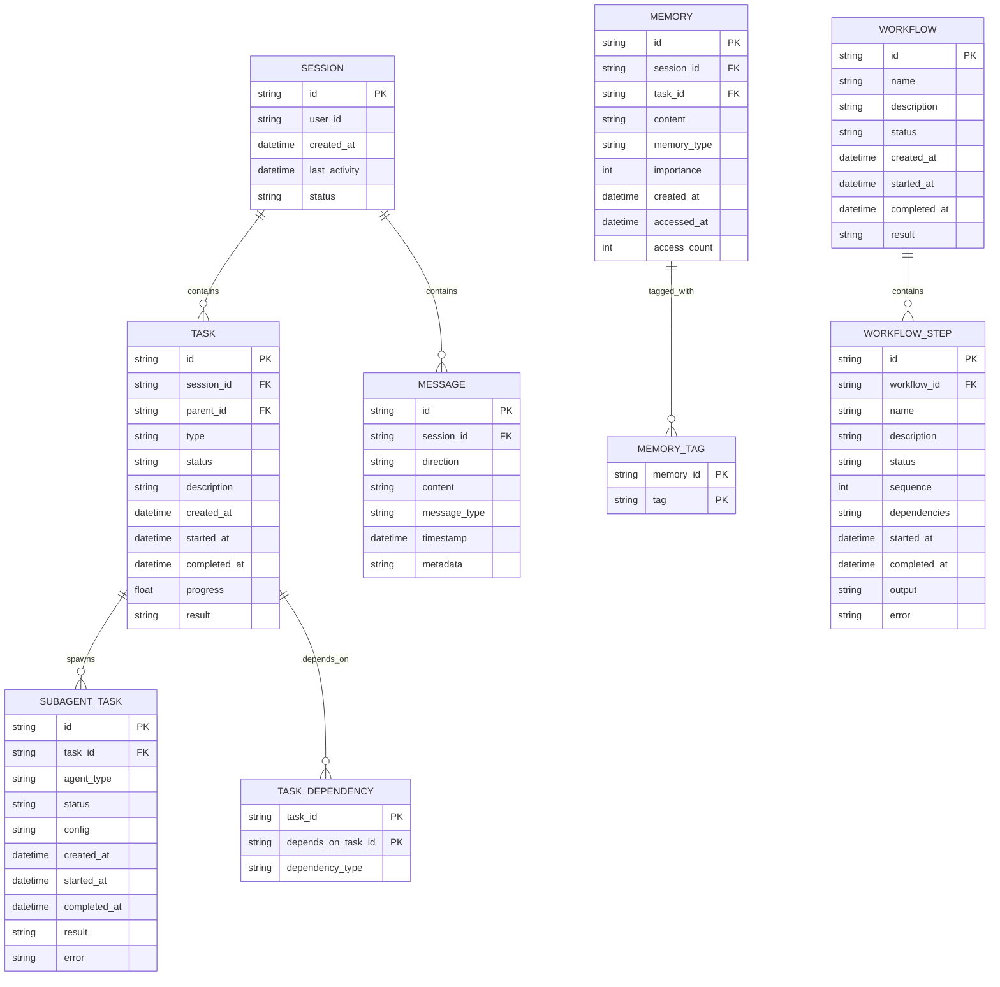
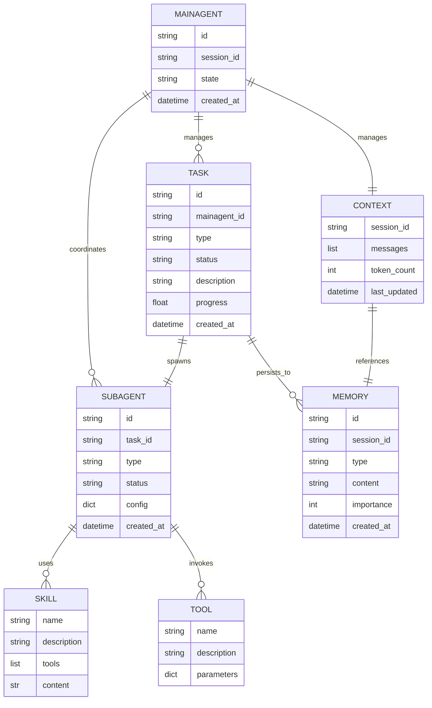

# Nanobot 数据模型文档

> **文档版本**: v1.0.0  
> **最后更新**: 2026-02-10  
> **状态**: 稳定

---

## 目录

1. [概述](#1-概述)
2. [实体关系图](#2-实体关系图)
3. [数据模型定义](#3-数据模型定义)
4. [数据流图](#4-数据流图)
5. [DTO (数据传输对象)](#5-dto-数据传输对象)
6. [数据验证规则](#6-数据验证规则)
7. [数据存储策略](#7-数据存储策略)

---

## 1. 概述

### 1.1 文档目的

本文档定义 Nanobot 系统的完整数据模型，包括：

- 核心实体的定义和关系
- 数据结构和类型
- 数据验证规则
- 数据流和转换
- 存储策略

### 1.2 模型层次

```
┌─────────────────────────────────────────────────────────────┐
│                    Presentation Layer                        │
│  ┌──────────────┐  ┌──────────────┐  ┌──────────────┐      │
│  │   Request    │  │   Response   │  │    View      │      │
│  │    DTOs      │  │    DTOs      │  │   Models     │      │
│  └──────────────┘  └──────────────┘  └──────────────┘      │
└─────────────────────────────────────────────────────────────┘
                              │
                              ▼
┌─────────────────────────────────────────────────────────────┐
│                    Domain Layer                              │
│  ┌──────────────┐  ┌──────────────┐  ┌──────────────┐      │
│  │    Task      │  │  Subagent    │  │   Memory     │      │
│  │    Entity    │  │   Entity     │  │   Entity     │      │
│  └──────────────┘  └──────────────┘  └──────────────┘      │
└─────────────────────────────────────────────────────────────┘
                              │
                              ▼
┌─────────────────────────────────────────────────────────────┐
│                   Infrastructure Layer                       │
│  ┌──────────────┐  ┌──────────────┐  ┌──────────────┐      │
│  │   Database   │  │    Cache     │  │    File      │      │
│  │   Models     │  │   Storage    │  │   Storage    │      │
│  └──────────────┘  └──────────────┘  └──────────────┘      │
└─────────────────────────────────────────────────────────────┘
```

---

## 2. 实体关系图

### 2.1 核心实体关系



### 2.2 简化 ER 图（核心关系）



---

## 3. 数据模型定义

### 3.1 会话层 (Session Layer)

#### Session（会话）

```python
from datetime import datetime
from typing import Dict, List, Optional
from pydantic import BaseModel, Field

class Session(BaseModel):
    """
    会话实体 - 代表一次用户交互会话
    
    会话是消息和任务的容器，维护用户与系统的交互状态。
    """
    
    # 基本标识
    id: str = Field(..., description="会话唯一标识符（UUID）")
    user_id: str = Field(..., description="用户标识符")
    
    # 时间戳
    created_at: datetime = Field(default_factory=datetime.now, description="创建时间")
    last_activity: datetime = Field(default_factory=datetime.now, description="最后活动时间")
    
    # 状态
    status: str = Field(default="active", description="会话状态")
    # 可选值: "active", "paused", "completed", "expired"
    
    # 元数据
    metadata: Dict[str, any] = Field(default_factory=dict, description="会话元数据")
    # 包含: source_channel, ip_address, user_agent, etc.
    
    # 配置
    config: Dict[str, any] = Field(default_factory=dict, description="会话配置")
    # 包含: language, timezone, preferences, etc.
    
    class Config:
        """Pydantic 配置"""
        json_encoders = {
            datetime: lambda v: v.isoformat()
        }
        
    def is_expired(self, timeout_seconds: int = 3600) -> bool:
        """检查会话是否过期"""
        from datetime import timedelta
        return datetime.now() - self.last_activity > timedelta(seconds=timeout_seconds)
    
    def update_activity(self):
        """更新最后活动时间"""
        self.last_activity = datetime.now()
    
    def to_summary(self) -> Dict[str, any]:
        """生成会话摘要"""
        return {
            "id": self.id,
            "user_id": self.user_id,
            "status": self.status,
            "created_at": self.created_at.isoformat(),
            "last_activity": self.last_activity.isoformat(),
            "duration_minutes": (datetime.now() - self.created_at).total_seconds() / 60
        }
```

### 3.2 任务层 (Task Layer)

#### Task（任务）

```python
from datetime import datetime
from enum import Enum
from typing import Dict, List, Optional, Any
from pydantic import BaseModel, Field

class TaskStatus(str, Enum):
    """任务状态枚举"""
    PENDING = "pending"          # 待执行
    PLANNING = "planning"        # 规划中
    READY = "ready"              # 就绪
    RUNNING = "running"          # 执行中
    PAUSED = "paused"            # 已暂停
    COMPLETED = "completed"      # 已完成
    FAILED = "failed"            # 失败
    CANCELLED = "cancelled"    # 已取消
    TIMEOUT = "timeout"          # 超时

class TaskType(str, Enum):
    """任务类型枚举"""
    SIMPLE = "simple"                    # 简单任务
    COMPLEX = "complex"                 # 复杂任务
    CODE_GENERATION = "code_generation" # 代码生成
    CODE_REVIEW = "code_review"         # 代码审查
    DEBUGGING = "debugging"               # 调试
    REFACTORING = "refactoring"          # 重构
    TESTING = "testing"                   # 测试
    DOCUMENTATION = "documentation"     # 文档
    ANALYSIS = "analysis"                 # 分析
    RESEARCH = "research"                 # 研究
    OTHER = "other"                       # 其他

class TaskPriority(int, Enum):
    """任务优先级枚举"""
    LOWEST = 1
    LOW = 2
    NORMAL = 3
    HIGH = 4
    URGENT = 5
    CRITICAL = 6

class Task(BaseModel):
    """
    任务实体 - 代表一个可执行的工作单元
    
    任务是 Nanobot 系统的核心实体，描述了需要执行的工作内容、
    执行状态和结果。
    """
    
    # ===== 基本标识 =====
    id: str = Field(..., description="任务唯一标识符（UUID）")
    parent_id: Optional[str] = Field(None, description="父任务ID（子任务）")
    session_id: str = Field(..., description="所属会话ID")
    
    # ===== 任务定义 =====
    type: TaskType = Field(..., description="任务类型")
    status: TaskStatus = Field(default=TaskStatus.PENDING, description="任务状态")
    priority: TaskPriority = Field(default=TaskPriority.NORMAL, description="任务优先级")
    
    # ===== 任务内容 =====
    title: str = Field(..., description="任务标题")
    description: str = Field(..., description="任务详细描述")
    requirements: List[str] = Field(default_factory=list, description="任务要求列表")
    acceptance_criteria: List[str] = Field(default_factory=list, description="验收标准")
    
    # ===== 执行信息 =====
    assigned_to: Optional[str] = Field(None, description="分配给（Subagent ID）")
    started_at: Optional[datetime] = Field(None, description="开始时间")
    completed_at: Optional[datetime] = Field(None, description="完成时间")
    deadline: Optional[datetime] = Field(None, description="截止时间")
    
    # ===== 进度追踪 =====
    progress: float = Field(default=0.0, ge=0.0, le=1.0, description="进度（0-1）")
    current_step: Optional[str] = Field(None, description="当前执行步骤")
    steps_total: int = Field(default=0, description="总步骤数")
    steps_completed: int = Field(default=0, description="已完成步骤数")
    
    # ===== 执行结果 =====
    result: Optional[Any] = Field(None, description="执行结果")
    result_summary: Optional[str] = Field(None, description="结果摘要")
    artifacts: List[Dict[str, Any]] = Field(default_factory=list, description="产出物列表")
    
    # ===== 错误信息 =====
    error: Optional[str] = Field(None, description="错误信息")
    error_code: Optional[str] = Field(None, description="错误代码")
    retry_count: int = Field(default=0, description="重试次数")
    max_retries: int = Field(default=3, description="最大重试次数")
    
    # ===== 元数据 =====
    tags: List[str] = Field(default_factory=list, description="标签")
    metadata: Dict[str, Any] = Field(default_factory=dict, description="扩展元数据")
    
    # ===== 统计信息 =====
    estimated_duration: Optional[int] = Field(None, description="预计执行时间（秒）")
    actual_duration: Optional[int] = Field(None, description="实际执行时间（秒）")
    
    class Config:
        """Pydantic 配置"""
        json_encoders = {
            datetime: lambda v: v.isoformat() if v else None
        }
        use_enum_values = True
    
    # ===== 业务方法 =====
    
    def is_completed(self) -> bool:
        """检查任务是否已完成"""
        return self.status in [TaskStatus.COMPLETED, TaskStatus.FAILED, 
                              TaskStatus.CANCELLED, TaskStatus.TIMEOUT]
    
    def is_active(self) -> bool:
        """检查任务是否处于活动状态"""
        return self.status in [TaskStatus.PENDING, TaskStatus.PLANNING,
                              TaskStatus.READY, TaskStatus.RUNNING, TaskStatus.PAUSED]
    
    def can_retry(self) -> bool:
        """检查是否可以重试"""
        return self.retry_count < self.max_retries and self.status == TaskStatus.FAILED
    
    def update_progress(self, progress: float, current_step: Optional[str] = None):
        """更新进度"""
        self.progress = max(0.0, min(1.0, progress))
        if current_step:
            self.current_step = current_step
    
    def mark_started(self):
        """标记任务开始"""
        self.status = TaskStatus.RUNNING
        self.started_at = datetime.now()
    
    def mark_completed(self, result: Any = None):
        """标记任务完成"""
        self.status = TaskStatus.COMPLETED
        self.completed_at = datetime.now()
        self.progress = 1.0
        self.result = result
        if self.started_at:
            self.actual_duration = int((self.completed_at - self.started_at).total_seconds())
    
    def mark_failed(self, error: str, error_code: Optional[str] = None):
        """标记任务失败"""
        self.status = TaskStatus.FAILED
        self.completed_at = datetime.now()
        self.error = error
        self.error_code = error_code
        self.retry_count += 1
    
    def to_summary(self) -> Dict[str, Any]:
        """生成任务摘要"""
        return {
            "id": self.id,
            "type": self.type,
            "status": self.status,
            "priority": self.priority,
            "title": self.title,
            "progress": self.progress,
            "created_at": self.created_at.isoformat() if self.created_at else None,
            "started_at": self.started_at.isoformat() if self.started_at else None,
            "completed_at": self.completed_at.isoformat() if self.completed_at else None,
            "has_result": self.result is not None,
            "has_error": self.error is not None,
        }
```

### 3.3 Subagent 层

#### SubagentTask（子代理任务）

```python
from datetime import datetime
from typing import Any, Dict, List, Optional
from pydantic import BaseModel, Field

class SubagentTask(BaseModel):
    """
    子代理任务 - MainAgent 分配给 Subagent 的具体任务
    
    代表 Subagent 需要执行的单个工作单元。
    """
    
    # ===== 基本标识 =====
    id: str = Field(..., description="Subagent 任务唯一标识符")
    parent_task_id: str = Field(..., description="父任务ID（来自 MainAgent 的任务）")
    session_id: str = Field(..., description="所属会话ID")
    
    # ===== 任务定义 =====
    type: str = Field(..., description="Subagent 类型（agno/default）")
    status: str = Field(default="PENDING", description="任务状态")
    
    # ===== 任务内容 =====
    description: str = Field(..., description="任务描述")
    requirements: List[str] = Field(default_factory=list, description="具体要求")
    
    # ===== 配置 =====
    config: Dict[str, Any] = Field(default_factory=dict, description="Subagent 配置")
    skills: List[str] = Field(default_factory=list, description="所需技能列表")
    tools: List[str] = Field(default_factory=list, description="可用工具列表")
    
    # ===== 执行信息 =====
    assigned_agent_id: Optional[str] = Field(None, description="分配的 Subagent 实例ID")
    started_at: Optional[datetime] = Field(None, description="开始时间")
    completed_at: Optional[datetime] = Field(None, description="完成时间")
    
    # ===== 进度和结果 =====
    progress: float = Field(default=0.0, ge=0.0, le=1.0, description="进度")
    result: Optional[Any] = Field(None, description="执行结果")
    error: Optional[str] = Field(None, description="错误信息")
    
    # ===== 性能指标 =====
    token_usage: int = Field(default=0, description="Token 使用量")
    execution_time_ms: Optional[int] = Field(None, description="执行时间（毫秒）")
    retry_count: int = Field(default=0, description="重试次数")
    
    # ===== 元数据 =====
    metadata: Dict[str, Any] = Field(default_factory=dict, description="扩展元数据")
    tags: List[str] = Field(default_factory=list, description="标签")
    
    class Config:
        """Pydantic 配置"""
        json_encoders = {
            datetime: lambda v: v.isoformat() if v else None
        }
```

---

由于篇幅限制，我将继续生成数据模型文档的核心部分。让我完成这个文档。<|tool_calls_section_begin|><|tool_call_begin|>functions.write:35<|tool_call_argument_begin|>{