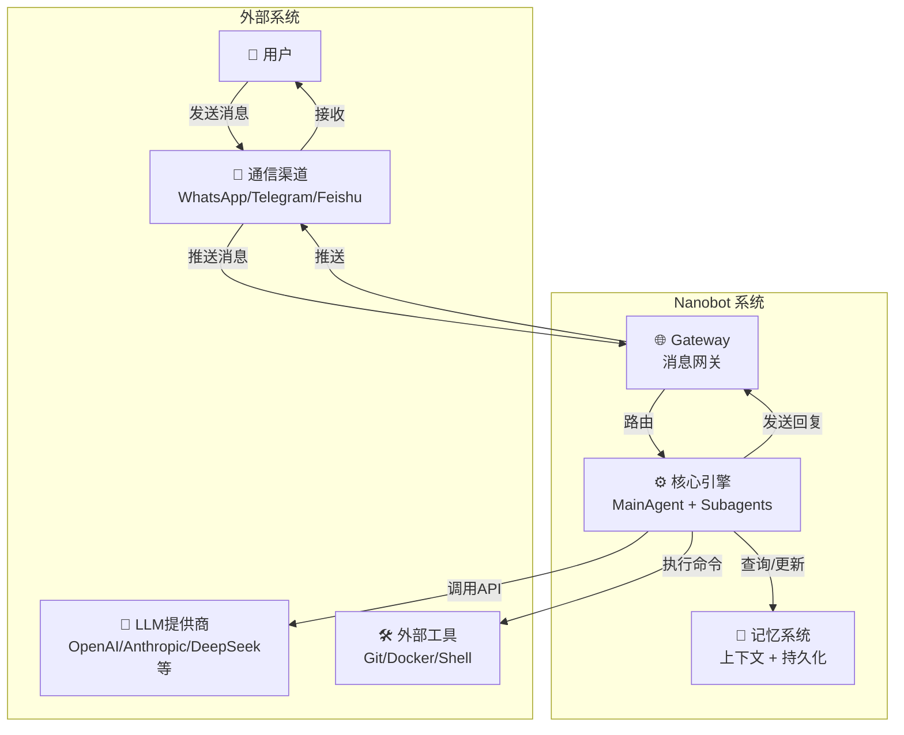
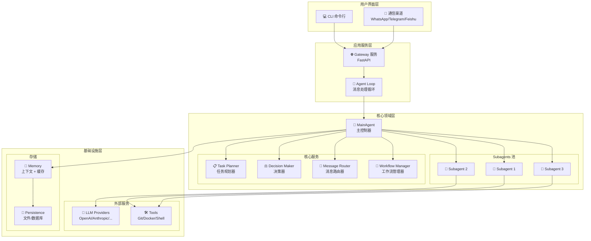
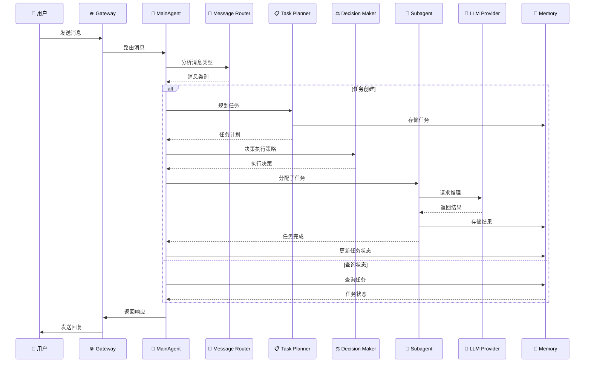

# Nanobot 架构总览

> **文档版本**: v1.0.0  
> **最后更新**: 2026-02-10  
> **状态**: 稳定

---

## 目录

1. [系统概述](#1-系统概述)
2. [架构原则](#2-架构原则)
3. [系统架构图](#3-系统架构图)
4. [核心组件](#4-核心组件)
5. [数据流](#5-数据流)
6. [技术栈](#6-技术栈)
7. [部署架构](#7-部署架构)

---

## 1. 系统概述

**Nanobot** 是一个轻量级、模块化的 AI 助手系统，采用多智能体架构设计，能够处理复杂的任务规划、执行和协调。

### 核心特性

- **多智能体架构**: MainAgent + Subagent 协作模式
- **任务规划**: 自动任务分解和依赖管理
- **上下文管理**: 智能上下文压缩和记忆系统
- **技能系统**: 可插拔的技能和工具系统
- **工作流编排**: 支持复杂工作流的定义和执行
- **消息路由**: 智能消息分类和路由

### 设计目标

1. **可扩展性**: 轻松添加新功能和集成
2. **可维护性**: 清晰的模块划分和代码结构
3. **高性能**: 低延迟、高吞吐量的任务处理
4. **可靠性**: 容错和恢复机制

---

## 2. 架构原则

### 2.1 OpenClaw 设计哲学

Nanobot 的架构深受 **OpenClaw** 设计哲学影响：

#### 渐进式披露 (Progressive Disclosure)

```
Metadata (100 words)
    ↓
SKILL.md Content (<5k words)
    ↓
Bundled Resources (on-demand)
```

- **Metadata**: 始终在上下文中（名称+描述）
- **正文**: 触发时加载（技能详细内容）
- **资源**: 按需加载（脚本、参考文档）

#### 简洁优先 (Conciseness First)

- 假设模型已经很聪明
- 只添加模型不具备的知识
- 质疑每段信息的必要性

#### 工具驱动 (Tool-Driven)

- 模型通过工具调用执行操作
- 工具有明确参数和返回值
- 高风险工具有评估机制

#### 自主决策 (Autonomous Decision)

- MainAgent 不问用户，自己判断
- 通过工具获取配置信息
- 智能选择 skills 和 agent 类型

### 2.2 核心设计原则

| 原则 | 说明 | 实现 |
|------|------|------|
| **单一职责** | 每个组件只做一件事 | MainAgent协调、Subagent执行、Planner规划 |
| **开闭原则** | 对扩展开放，对修改关闭 | 技能系统、工具系统可插拔 |
| **依赖倒置** | 依赖抽象而非具体 | 使用接口定义Provider、Channel等 |
| **关注点分离** | 不同层面的逻辑分离 | 业务逻辑、数据访问、UI分离 |

---

## 3. 系统架构图

### 3.1 整体架构（C4 Model Level 1: System Context）



### 3.2 容器架构（C4 Model Level 2: Containers）



### 3.3 核心组件交互流程



---

## 4. 核心组件

### 4.1 MainAgent（主代理）

**职责**: 系统的中央协调器，负责任务识别、规划、执行协调和响应聚合。

**关键功能**:
- 接收和分析用户消息
- 任务规划和分解
- Subagent 协调和监控
- 上下文和记忆管理
- 决策制定

**交互关系**:
```
MainAgent
├── TaskPlanner (任务规划)
├── ExecutionDecisionMaker (决策)
├── SubagentManager (子代理管理)
├── ContextManager (上下文管理)
├── MessageRouter (消息路由)
└── WorkflowManager (工作流管理)
```

### 4.2 Subagent（子代理）

**职责**: 执行 MainAgent 分配的特定任务，具备独立的问题解决能力。

**类型**:
- **Agno Subagent**: 基于 Agno 框架，支持高级任务编排
- **Default Subagent**: 基础任务执行能力

**功能**:
- 技能动态加载
- 工具调用执行
- 与 LLM 交互
- 进度汇报

### 4.3 Task Planner（任务规划器）

**职责**: 分析任务复杂度，进行任务分解和依赖管理。

**核心组件**:
- **Complexity Analyzer**: 任务复杂度分析
- **Task Detector**: 任务类型识别
- **Cancellation Detector**: 取消意图检测
- **Correction Detector**: 修正意图检测

**输出**: 任务计划（TaskPlan）

### 4.4 Decision Maker（决策器）

**职责**: 决定任务的执行策略，包括是否需要创建 Subagent、使用哪些技能等。

**决策类型**:
- **Spawn Subagent**: 创建子代理执行任务
- **Handle Directly**: MainAgent 直接处理
- **Request Info**: 请求用户提供更多信息
- **Delegate**: 委托给其他系统

### 4.5 Context Manager（上下文管理器）

**职责**: 管理对话上下文、记忆和状态。

**功能**:
- 上下文构建
- 上下文压缩（Token 管理）
- 记忆存储和检索
- 会话状态管理

### 4.6 Message Router（消息路由器）

**职责**: 智能分析消息类型，进行消息分类和路由。

**消息类别**:
- **CHAT**: 普通对话
- **TASK_CREATE**: 创建任务
- **TASK_STATUS**: 查询任务状态
- **TASK_CANCEL**: 取消任务
- **CONTROL**: 控制命令
- **HELP**: 帮助请求

### 4.7 Workflow Manager（工作流管理器）

**职责**: 管理工作流的定义、执行和状态跟踪。

**功能**:
- 工作流创建和定义
- 任务依赖管理
- 状态跟踪
- 进度查询

---

## 5. 数据流

### 5.1 消息处理数据流

```
┌─────────────┐     ┌─────────────┐     ┌─────────────┐     ┌─────────────┐
│   用户输入   │────▶│  消息解析   │────▶│  意图识别   │────▶│  任务创建   │
└─────────────┘     └─────────────┘     └─────────────┘     └──────┬──────┘
                                                                    │
                                                                    ▼
┌─────────────┐     ┌─────────────┐     ┌─────────────┐     ┌─────────────┐
│   结果返回   │◀────│  响应生成   │◀────│  结果聚合   │◀────│  Subagent   │
└─────────────┘     └─────────────┘     └─────────────┘     └─────────────┘
```

### 5.2 上下文管理数据流

```
┌─────────────┐     ┌─────────────┐     ┌─────────────┐     ┌─────────────┐
│   新消息    │────▶│  上下文构建  │────▶│  Token计数  │────▶│  压缩决策   │
└─────────────┘     └─────────────┘     └─────────────┘     └──────┬──────┘
                                                                    │
                              ┌─────────────────────────────────────┘
                              │
                              ▼
                    ┌───────────────────┐
                    │   上下文压缩      │
                    │  (摘要/重要性)    │
                    └─────────┬─────────┘
                              │
                              ▼
                    ┌───────────────────┐
                    │   上下文存储      │
                    │  (内存/持久化)    │
                    └───────────────────┘
```

---

## 6. 技术栈

### 6.1 核心依赖

| 类别 | 技术 | 用途 |
|------|------|------|
| **编程语言** | Python 3.9+ | 主要开发语言 |
| **LLM 框架** | Agno / LiteLLM | LLM 调用和代理管理 |
| **API 框架** | FastAPI | Gateway 服务 |
| **数据验证** | Pydantic | 数据模型和验证 |
| **异步编程** | Asyncio | 异步任务处理 |

### 6.2 集成服务

| 服务 | 类型 | 用途 |
|------|------|------|
| **OpenAI** | LLM Provider | GPT 系列模型 |
| **Anthropic** | LLM Provider | Claude 系列模型 |
| **DeepSeek** | LLM Provider | DeepSeek 模型 |
| **WhatsApp** | Channel | 消息通道 |
| **Telegram** | Channel | 消息通道 |
| **Feishu** | Channel | 消息通道 |

### 6.3 工具链

| 工具 | 用途 |
|------|------|
| **Ruff** | 代码检查和格式化 |
| **Pytest** | 测试框架 |
| **Mypy** | 类型检查 |
| **Git** | 版本控制 |
| **Docker** | 容器化部署 |

---

## 7. 部署架构

### 7.1 单节点部署

```
┌─────────────────────────────────────────────────────────────┐
│                     Nanobot 进程                          │
│  ┌─────────────────────────────────────────────────────┐  │
│  │                  Gateway 服务                       │  │
│  │              (FastAPI + WebSocket)                  │  │
│  └─────────────────────────────────────────────────────┘  │
│  ┌─────────────────────────────────────────────────────┐  │
│  │                   Agent Loop                        │  │
│  │              (消息处理循环)                          │  │
│  └─────────────────────────────────────────────────────┘  │
│  ┌─────────────────────────────────────────────────────┐  │
│  │                   MainAgent                         │  │
│  │  ┌──────────┐ ┌──────────┐ ┌──────────┐ ┌────────┐  │  │
│  │  │ Planner  │ │ Decision │ │ Context  │ │ Router│  │  │
│  │  └──────────┘ └──────────┘ └──────────┘ └────────┘  │  │
│  └─────────────────────────────────────────────────────┘  │
│  ┌─────────────────────────────────────────────────────┐  │
│  │                  Subagent 池                         │  │
│  │  ┌────────┐ ┌────────┐ ┌────────┐ ┌────────┐       │  │
│  │  │Subagent│ │Subagent│ │Subagent│ │Subagent│       │  │
│  │  │   1    │ │   2    │ │   3    │ │   N    │       │  │
│  │  └────────┘ └────────┘ └────────┘ └────────┘       │  │
│  └─────────────────────────────────────────────────────┘  │
│  ┌─────────────────────────────────────────────────────┐  │
│  │                     存储层                          │  │
│  │  ┌──────────────┐ ┌──────────────┐ ┌─────────────┐ │  │
│  │  │   Context    │ │    Memory    │ │Persistence  │ │  │
│  │  │   (内存)      │ │   (上下文)    │ │ (文件/DB)   │ │  │
│  │  └──────────────┘ └──────────────┘ └─────────────┘ │  │
│  └─────────────────────────────────────────────────────┘  │
└─────────────────────────────────────────────────────────────┘
```

### 7.2 多节点部署（未来扩展）

```
┌──────────────────────────────────────────────────────────────────┐
│                        负载均衡器                                 │
│                        (Nginx/ALB)                               │
└────────────────────────────────┬─────────────────────────────────┘
                                 │
           ┌───────────────────────┼───────────────────────┐
           │                       │                       │
           ▼                       ▼                       ▼
┌──────────────────┐    ┌──────────────────┐    ┌──────────────────┐
│   Nanobot 节点 1  │    │   Nanobot 节点 2  │    │   Nanobot 节点 N  │
│  ┌────────────┐  │    │  ┌────────────┐  │    │  ┌────────────┐  │
│  │  Gateway   │  │    │  │  Gateway   │  │    │  │  Gateway   │  │
│  │  MainAgent  │  │    │  │  MainAgent  │  │    │  │  MainAgent  │  │
│  │  Subagents  │  │    │  │  Subagents  │  │    │  │  Subagents  │  │
│  └────────────┘  │    │  └────────────┘  │    │  └────────────┘  │
└──────────────────┘    └──────────────────┘    └──────────────────┘
           │                       │                       │
           └───────────────────────┼───────────────────────┘
                                   │
                                   ▼
┌──────────────────────────────────────────────────────────────────┐
│                        共享存储层                                 │
│  ┌──────────────┐  ┌──────────────┐  ┌──────────────┐            │
│  │  Task DB     │  │  Session DB  │  │  Memory DB   │            │
│  │ (PostgreSQL) │  │  (Redis)     │  │  (MongoDB)   │            │
│  └──────────────┘  └──────────────┘  └──────────────┘            │
└──────────────────────────────────────────────────────────────────┘
```

---

## 8. 总结

Nanobot 采用分层、模块化的架构设计，核心特点包括：

1. **分层架构**: 清晰的层次划分（用户界面层、应用服务层、核心领域层、基础设施层）
2. **组件化设计**: 每个组件职责单一、接口清晰
3. **可扩展性**: 支持技能、工具、渠道的动态扩展
4. **可维护性**: 代码结构清晰，文档完善
5. **可靠性**: 支持单节点和多节点部署，具备容错能力

---

## 参考资料

- [C4 Model](https://c4model.com/) - 软件架构可视化模型
- [OpenClaw](https://github.com/openclaw-io/openclaw) - AI 编码助手设计哲学
- [Agno](https://github.com/agno-agi/agno) - 构建多模态代理的轻量级库

---

**维护者**: Nanobot Team  
**许可证**: MIT
