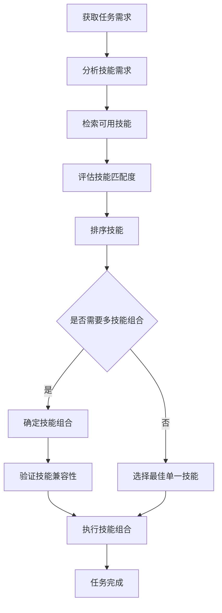

# 技能选择逻辑

## 核心原理

技能选择是 Nanobot 系统根据任务需求匹配最佳执行技能的关键过程。通过分析任务属性和技能特性，确保选择最适合的技能组合来完成任务。

## 选择流程

## 选择策略

### 1. 技能匹配度评估
- **精确匹配**：技能完全符合任务需求
- **部分匹配**：技能部分符合任务需求，需要补充其他技能
- **替代匹配**：使用替代技能完成任务

### 2. 技能优先级排序
- **技能熟练度**：优先选择熟练度高的技能
- **执行效率**：优先选择执行效率高的技能
- **可靠性**：优先选择可靠性高的技能
- **资源消耗**：优先选择资源消耗低的技能

### 3. 技能组合策略
- **互补组合**：选择功能互补的技能组合
- **冗余组合**：选择功能相似的技能作为备份
- **层次组合**：按照任务执行顺序选择技能组合

## 示例场景

### 场景 1：数据分析任务
**任务需求**：分析销售数据，生成可视化报告
**技能选择**：
- 技能需求：数据读取、数据清洗、数据分析、数据可视化
- 匹配技能：Pandas（数据处理）、Matplotlib（可视化）、NumPy（数值计算）
- 组合策略：互补组合
- 执行顺序：数据读取 → 数据清洗 → 数据分析 → 数据可视化

### 场景 2：代码优化任务
**任务需求**：优化 Python 脚本的运行效率
**技能选择**：
- 技能需求：代码分析、性能优化、代码重构
- 匹配技能：Profile（性能分析）、Cython（编译优化）、Numba（即时编译）
- 组合策略：层次组合
- 执行顺序：代码分析 → 性能优化 → 代码重构

## 最佳实践

1. **技能评估**：定期评估技能的性能和可靠性
2. **技能更新**：及时更新技能库，添加新技能
3. **组合测试**：测试技能组合的兼容性和执行效率
4. **动态调整**：根据任务执行情况，动态调整技能选择
5. **结果反馈**：收集任务执行结果，优化技能选择策略
