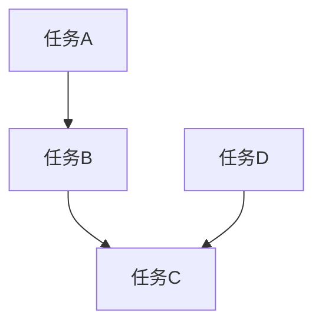

# Planning Skill

规划技能 - 任务分解和项目规划。

## 何时使用此技能

当任务涉及以下内容时使用：
- 任务分解和优先级排序
- 项目规划和时间估算
- 风险评估和缓解
- 依赖管理
- 资源分配

## 任务分解方法

### 1. WBS（工作分解结构）

将任务分解为子任务：
- 总任务 → 阶段 → 子任务 → 活动
- 每个级别清晰明确
- 可交付成果明确

### 2. MoSCoW 优先级排序

按重要性排序：
- **Must**（必须做）：核心需求
- **Should**（应该做）：重要但非核心
- **Could**（可以做）：有价值但可选
- **Won't**（不会做）：当前版本不包含

### 3. Eisenhower 矩阵

按紧急程度和重要性分类：
- 重要紧急：立即处理
- 重要不紧急：计划处理
- 紧急不重要：委托他人
- 不紧急不重要：删除或推迟

## 时间估算

### 1. 三点估算

使用乐观、悲观和最可能时间：
```
预计时间 = (乐观 + 4*最可能 + 悲观) / 6
```

### 2. 专家判断

咨询经验丰富的团队成员：
- 收集多个专家的估算
- 使用平均值或加权平均

### 3. 历史数据

参考类似任务的历史记录：
- 查找类似任务的实际耗时
- 考虑当前任务的差异

## 风险评估

### 1. 风险识别

识别潜在风险：
- 技术风险（技术难题、依赖问题）
- 进度风险（时间估算不准确）
- 资源风险（人员不足）
- 质量风险（测试覆盖不足）

### 2. 风险分析

分析风险影响和概率：
| 概率 | 影响 | 风险等级 |
|------|------|----------|
| 高 | 高 | 严重 |
| 高 | 中 | 高 |
| 中 | 高 | 高 |
| 中 | 中 | 中 |
| 低 | 高 | 中 |
| 高 | 低 | 低 |

### 3. 风险缓解

制定风险缓解策略：
- **避免**：消除风险源
- **转移**：将风险转移给第三方
- **减轻**：降低风险概率或影响
- **接受**：接受风险并制定应急计划

## 依赖管理

### 1. 识别依赖关系

- 任务依赖
- 资源依赖
- 外部依赖

### 2. 可视化依赖

使用图表可视化依赖：


### 3. 处理依赖

- 并行执行独立任务
- 优先处理关键路径任务
- 管理外部依赖的风险

## 项目规划示例

### 简单项目计划

```markdown
# 项目：电商平台开发

## 阶段 1：需求分析（2周）
- 收集用户需求
- 市场调研
- 竞品分析
- 制定需求文档

## 阶段 2：架构设计（1周）
- 系统架构设计
- 技术选型
- 数据库设计
- API 设计

## 阶段 3：开发（6周）
- 用户管理模块（1周）
- 商品管理模块（1.5周）
- 购物车模块（1周）
- 订单管理模块（1.5周）
- 支付集成（1周）

## 阶段 4：测试（2周）
- 单元测试
- 集成测试
- 端到端测试
- 性能测试

## 阶段 5：部署（1周）
- 生产环境部署
- 监控配置
- 安全检查
- 启动服务
```

## 每日规划

### 每日任务清单

```markdown
# 2024-01-15 计划

## 重要紧急
1. 修复生产环境的 bug（高优先级）
2. 完成客户报告

## 重要不紧急
1. 重构用户管理代码
2. 编写技术文档

## 紧急不重要
1. 回复客户邮件
2. 参加团队会议

## 不紧急不重要
1. 整理代码库
2. 学习新技术
```

## 规划最佳实践

### 1. 保持灵活

- 计划会随着项目进展而变化
- 定期回顾和调整计划
- 接受不确定性

### 2. 持续沟通

- 与团队沟通计划
- 管理利益相关者期望
- 及时分享进度

### 3. 保持简单

- 避免过度规划
- 专注于关键任务
- 保持计划易读

## 工具和技术

### 项目管理工具

- **Jira**：敏捷项目管理
- **Trello**：看板管理
- **Notion**：文档和项目管理
- **Microsoft Project**：传统项目管理

### 协作工具

- **Slack**：团队沟通
- **Microsoft Teams**：视频会议和协作
- **Zoom**：远程会议

### 文档工具

- **Confluence**：团队文档
- **Markdown**：轻量级文档
- **Google Docs**：在线协作

## 常见规划问题

### 1. 过度规划

**症状**：花费大量时间详细规划，但项目变更频繁。

**解决方案**：
- 使用敏捷方法
- 增量规划
- 接受不确定性

### 2. 不切实际的时间估算

**症状**：项目延迟，团队压力大。

**解决方案**：
- 使用三点估算
- 增加缓冲区
- 定期回顾和调整

### 3. 缺乏风险评估

**症状**：未预料到的问题导致项目延迟。

**解决方案**：
- 定期进行风险评估
- 制定应急预案
- 管理风险缓解策略

## 参考资源

详见 [PLANNING_PATTERNS.md](references/PLANNING_PATTERNS.md) 了解常见规划模式。
详见 [PROJECT_MANAGEMENT_GUIDE.md](references/PROJECT_MANAGEMENT_GUIDE.md) 了解项目管理最佳实践。

## 工具使用

此技能通常配合以下工具使用：
- `ReadFileTool` - 读取项目文档
- `WriteFileTool` - 写入计划文档
- `WebSearchTool` - 查找规划方法
- `ExecTool` - 运行项目管理工具

记住：好的规划是成功的一半，但灵活性同样重要。
